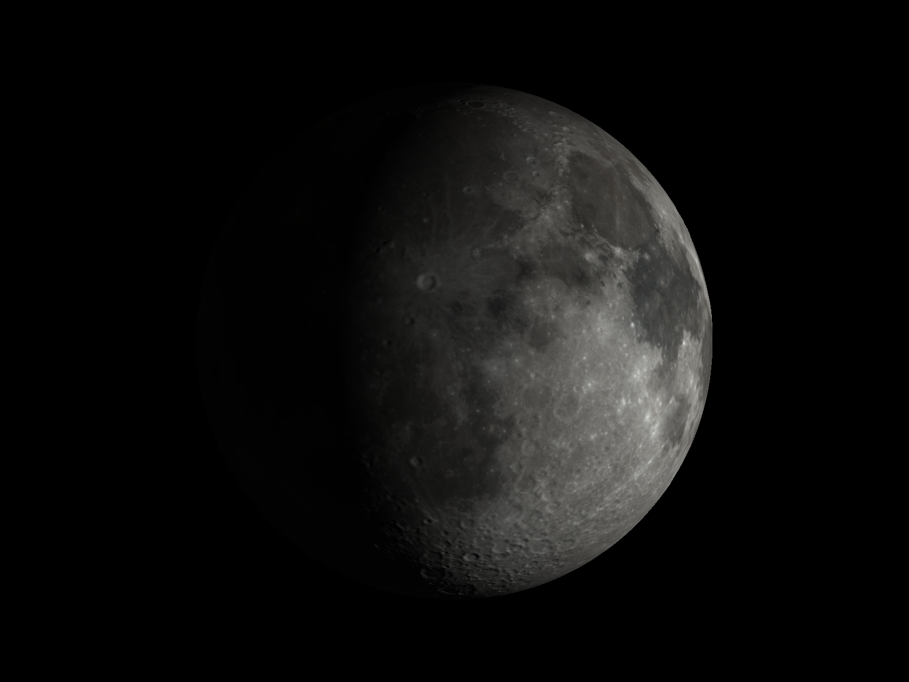
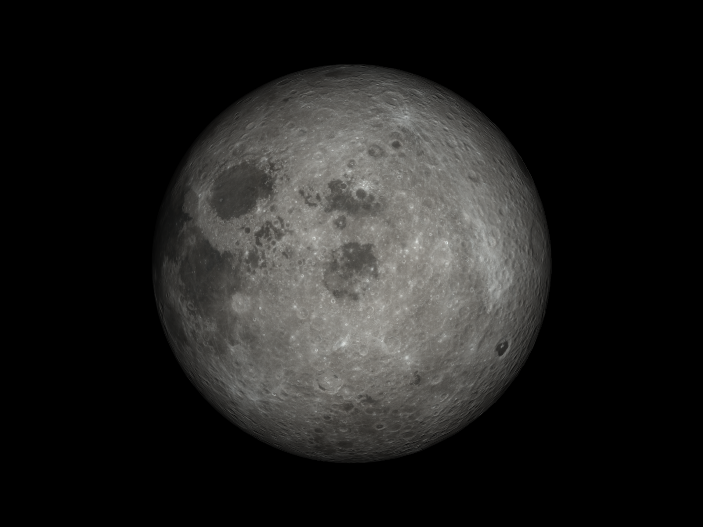
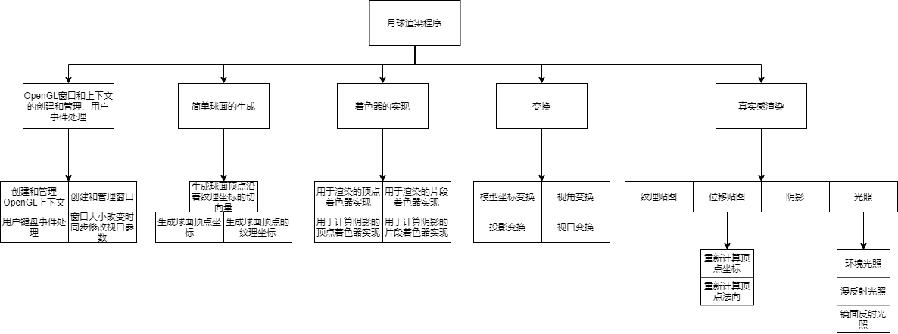
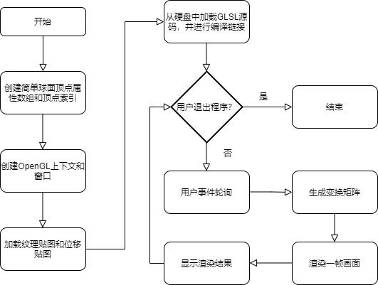
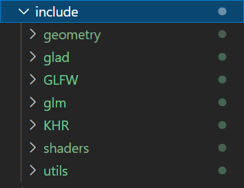
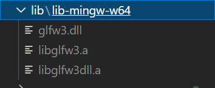
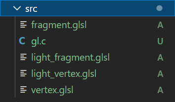
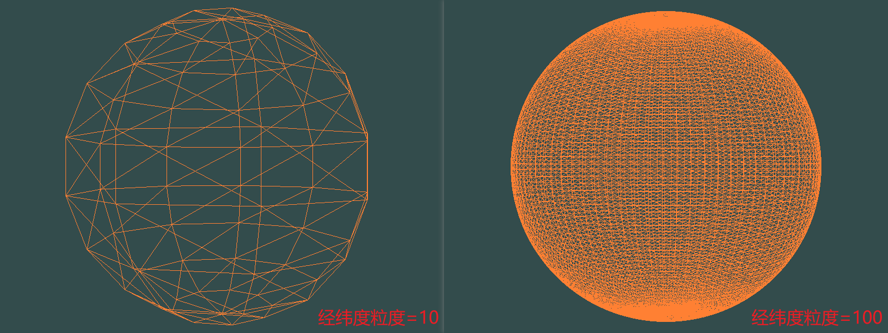
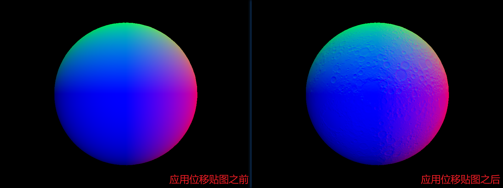

[toc]

# Moon
Render the moon in OpenGL.

月球渲染——计算机图形学作业。

有些概念掌握得不太好，求大佬们放过~






## 一、总体设计

### 1.1 程序模块结构

月球渲染程序一共包含OpenGL上下文与窗口的创建以及用户事件的处理、简单球面的生成、着色器的实现、变换以及真实感渲染等几大模块。该程序的程序模块结构图如下图所示：



月球渲染程序的渲染结果需要呈现给用户，因此需要创建一个窗口来显示渲染结果，同时接收用户键盘事件，实现与用户的实时交互。当窗口大小发生变化时，还需要同步调整视口参数，使渲染结果能够正确地显示在窗口内。简单球面是渲染月球模型的基础，简单球面的生成是指生成一个球面顶点属性数组和球面顶点索引数组，球面顶点属性数组中包含了球面顶点坐标、球面顶点的纹理坐标、球面顶点沿着纹理坐标的切向量等属性。着色器的实现包含了使用GLSL编写用于渲染的顶点着色器和片段着色器以及用于计算阴影的顶点着色器和片段着色器，同时还包含了一个加载着色器源代码并进行编译和链接生成着色程序的Shader类。变换包含模型坐标变换、将模型坐标转到相机坐标系下的视角变换、投影变换以及视口变换等。真实感渲染包含了颜色纹理贴图、位移贴图、阴影和光照计算等。其中在应用位移贴图时，需要根据位移量重新计算顶点的坐标和法向量，在光照计算中包含了环境光照计算、漫反射光照计算和镜面反射光照计算三部分。

### 1.2 简单球面的生成

简单球面是月球模型的骨架。由空间解析几何的知识可知，在空间直角坐标系下，球面的一般方程为：

```math
(x-a)^2 + (y-b)^2 + (z-c)^2 = r^2
```

其中 $x, y, z$ 是球面上点的坐标， $a, b, c$ 是球心的坐标， $r$ 是球的半径。由球面的一般方程生成球面顶点坐标涉及开根运算，每个坐标分量的确定需要先确定另外两个坐标分量，同时也不方便计算球面上顶点的切向量，这里使用更合适的球面的参数方程来生成球面顶点坐标：

```math
\left\{\begin{array}{ccccc}
x &= &a &+ &r\sin\phi\cos\theta \\
y &= &b &+ &r\cos\phi \\
z &= &c &- &r\sin\phi\sin\theta
\end{array}\right.
```

其中 $x, y, z$ 是球面上点的坐标， $a, b, c$ 是球心的坐标， $r$ 是球的半径。 $\phi \in [0, \pi]$ ，方向为从 $y$ 轴负向逆时针旋转到 $y$ 轴正向。 $\theta \in [0, 2\pi]$ ，方向为从 $x$ 轴正向出发，逆时针旋转回到 $x$ 轴正向。为了实现的方便，令球心为原点，则：

```math
\left\{\begin{array}{ccc}
x &= &r\sin\phi\cos\theta \\
y &= &r\cos\phi \\
z &= &-r\sin\phi\sin\theta
\end{array}\right.
```

作变量替换，令 $\phi = \pi v, \theta = 2\pi u, u \in [0, 1], v \in [0, 1]$ ，则：

```math
\left\{\begin{array}{ccc}
x &= &r\sin(\pi v)\cos(2\pi u) \\
y &= &r\cos(\pi v) \\
z &= &-r\sin(\pi v)\sin(2\pi u)
\end{array}\right.
```

通过均匀地采样变量 $u$ 和变量 $v$ ，可以生成一系列球面上的点，同时变量 $u$ 和变量 $v$ 可以作为对应球面顶点的纹理坐标。

### 1.3 球面顶点法向量的计算

由于球心在原点的球面上某一点的法向量与该点的坐标相同，将该点的坐标单位化即可得到单位法向量。但是为了方便在应用位移贴图之后重新计算法向量，这里采用另一种方式计算球面上某一点的法向量。

由微积分的知识可知，过曲面上一点，且在曲面上的任意曲线在该点处的切线处于同一平面上，该平面称为曲面在该点的切平面，切平面的法向量即为曲面上该点的法向量。对于球面参数方程（4），若将变量 $v$ 当作常数，则参数方程（4）表示球面上关于变量 $u$ 的一条参数曲线，曲线在点 $(x, y, z)$ 处的切向量为：

```math
\left\{\begin{array}{ccccc}
u_x &= &\frac{\partial x}{\partial u} &= &-2\pi r\sin(\pi v)\sin(2\pi u) \\
u_y &= &\frac{\partial y}{\partial u} &= &0 \\
u_z &= &\frac{\partial z}{\partial u} &= &-2\pi r\sin(\pi v)\cos(2\pi u)
\end{array}\right.
```

其中 $u_x, u_y, u_z$ 分别是切向量的三个分量。同理，若将变量 $u$ 当作常数，则参数方程（4）表示球面上关于变量 $v$ 的一条参数曲线，曲线在点 $(x, y, z)$ 处的切向量为：

```math
\left\{\begin{array}{ccccc}
v_x &= &\frac{\partial x}{\partial v} &= &\pi r\cos(\pi v)\cos(2\pi u) \\
v_y &= &\frac{\partial y}{\partial v} &= &-\pi r\sin(\pi v) \\
v_z &= &\frac{\partial z}{\partial v} &= &-\pi r\cos(\pi v)\sin(2\pi u)
\end{array}\right.
```

其中 $v_x, v_y, v_z$ 分别是切向量的三个分量。分别求出两条参数曲线的在球面上某一点的切向量之后，作向量积 $[u_x, u_y, u_z]^T \times [v_x, v_y, v_z]^T$ 即得该点的法向量，将法向量单位化后即得单位法向量。

### 1.4 应用位移贴图之后顶点法向量的计算

设简单球面的参数方程为：

```math
\left\{\begin{array}{ccc}
x &= &x(u, v) \\
y &= &y(u, v) \\
z &= &z(u, v)
\end{array}\right.
```

其中 $x(u, v), y(u, v), z(u, v)$ 是关于变量 $u$ 和变量 $v$ 的二元函数且 $u \in [0, 1], v \in [0, 1]$ 。设位移贴图由二元函数 $d = g(u, v)$ 定义。添加位移贴图之前，球面上的点的坐标由球面的参数方程确定。添加位移贴图后，球面上的点坐标变为原球面坐标加上沿着该点的单位法向量的 $g(u, v)$ 倍的和，即：

```math
\left\{\begin{array}{ccccc}
x &= &x(u, v) &+ &n_x \cdot g(u, v) \\
y &= &y(u, v) &+ &n_y \cdot g(u, v) \\
z &= &z(u, v) &+ &n_z \cdot g(u, v)
\end{array}\right.
```

其中 $n_x, n_y, n_z$ 分别是简单球面上某一点的单位法向量的三个分量。由于：

```math
\left\{\begin{array}{ccc}
n_x &= &\frac{x(u, v)}{r} \\
n_y &= &\frac{y(u, v)}{r} \\
n_z &= &\frac{z(u, v)}{r}
\end{array}\right.
```

则：

```math
\left\{\begin{array}{ccccc}
x &= &x(u, v) &+ &\frac{x(u, v)}{r} \cdot g(u, v) \\
y &= &y(u, v) &+ &\frac{y(u, v)}{r} \cdot g(u, v) \\
z &= &z(u, v) &+ &\frac{z(u, v)}{r} \cdot g(u, v)
\end{array}\right.
```

从而关于变量 $u$ 的参数曲线在点 $(x, y, z)$ 处的切向量为：

```math
\left\{\begin{array}{ccc}
u_x &= &\frac{\partial x(u, v)}{\partial u} + \frac{1}{r} \cdot \frac{\partial x(u, v)}{\partial u} \cdot g(u, v) + \frac{1}{r} \cdot x(u, v) \cdot \frac{\partial g(u, v)}{\partial u} \\
u_y &= &\frac{\partial y(u, v)}{\partial u} + \frac{1}{r} \cdot \frac{\partial y(u, v)}{\partial u} \cdot g(u, v) + \frac{1}{r} \cdot y(u, v) \cdot \frac{\partial g(u, v)}{\partial u} \\
u_z &= &\frac{\partial z(u, v)}{\partial u} + \frac{1}{r} \cdot \frac{\partial z(u, v)}{\partial u} \cdot g(u, v) + \frac{1}{r} \cdot z(u, v) \cdot \frac{\partial g(u, v)}{\partial u}
\end{array}\right.
```

同理可得关于变量 $v$ 的参数曲线在点 $(x, y, z)$ 处的切向量为：

```math
\left\{\begin{array}{ccc}
v_x &= &\frac{\partial x(u, v)}{\partial v} + \frac{1}{r} \cdot \frac{\partial x(u, v)}{\partial v} \cdot g(u, v) + \frac{1}{r} \cdot x(u, v) \cdot \frac{\partial g(u, v)}{\partial v} \\
v_y &= &\frac{\partial y(u, v)}{\partial v} + \frac{1}{r} \cdot \frac{\partial y(u, v)}{\partial v} \cdot g(u, v) + \frac{1}{r} \cdot y(u, v) \cdot \frac{\partial g(u, v)}{\partial v} \\
v_z &= &\frac{\partial z(u, v)}{\partial v} + \frac{1}{r} \cdot \frac{\partial z(u, v)}{\partial v} \cdot g(u, v) + \frac{1}{r} \cdot z(u, v) \cdot \frac{\partial g(u, v)}{\partial v}
\end{array}\right.
```

根据公式(11)和公式（12）分别求出两条参数曲线在球面上某一点的切向量之后，作向量积 $[u_x, u_y, u_z]^T \times [v_x, v_y, v_z]^T$ 即得该点的法向量，将法向量单位化后即得单位法向量

### 1.5 渲染程序运行流程

月球渲染程序的程序流程图如下图所示：



程序开始运行后，首先使用自定义的`Sphere`类实例化一个简单球面对象，`Sphere`类的构造函数接受球体的半径，经纬度的粒度作为参数，并根据这些参数生成一个顶点属性数组和顶点索引数组，这两个数组最终将作为顶点着色器的输入。紧接着程序开始初始化OpenGL上下文，并创建一个窗口，用于显示渲染结果。然后程序开始读取存储在硬盘中的纹理贴图和位移贴图。随后程序使用自定义的`Shader`类从硬盘读取顶点着色器程序代码和片段着色器程序代码，并完成对源代码的编译和链接。完成着色程序的创建之后，程序进入一个循环。在循环中，程序先对用户触发的事件（如键盘事件或窗口大小更改事件等）进行响应，接着生成新的变换矩阵，用于旋转月球和光源，然后程序再调用着色程序渲染出一帧的画面，将画面显示到窗口上，完成一次的循环。若用户触发关闭事件，则程序中止退出。

## 二、具体实现

### 2.1 开发工具与依赖库

开发月球渲染程序所需的开发工具有Visual Studio Code（以下简称`VS Code`）代码编辑器和`MinGW-w64`编译器，依赖库有`GLFW`、`GLAD`、`GLM`以及`stb_image`等。其中`GLFW`用于创建和管理OpenGL上下文和窗口，提供用户事件处理等功能，`GLAD`提供了获取OpenGL函数指针的支持，`GLM`提供了向量和矩阵容器，以及一系列关于向量和矩阵操作的函数，`stb_image`提供了从硬盘读取图片文件内容的功能。

### 2.2 构建开发环境

#### 2.2.1 下载GLFW库

到[GLFW官网](https://www.glfw.org/download.html)下载Windows预编译二进制包，并将`lib-mingw-w64`文件夹和`include`文件夹分别解压到`Moon`目录下的`lib`文件夹和`include`文件夹中。

#### 2.2.2 下载GLM库

从[GLM](https://github.com/g-truc/glm/tags)官方仓库下载`GLM`源码压缩包，并将头文件根目录`glm`文件夹解压到`Moon`目录下的`include`文件夹中。

#### 2.2.3 下载stb_image库

从[stb_image](https://github.com/nothings/stb)官方仓库下载`stb_image.h`和`stb_image_write.h`，在`Moon/include`目录下新建`utils`文件夹，并将下载的`stb_image.h`和`stb_image_write.h`文件放入`utils`文件夹中。

#### 2.2.4 配置GLAD

到[GLAD](https://gen.glad.sh/)的配置网站上配置Loader，依次在配置页面中进行如下操作：

1. `Generator`：选择`C/C++`；
2. `gl`：版本选择`Version 3.3`，`Core`；
3. 勾上`debug`选项；
4. 勾上`loader`选项。

点击`Generate`按钮，下载生成的`glad.zip`，并将`src`文件夹和`include`文件夹分别解压到`Moon`目录下的`src`文件夹和`include`文件夹中。

`GLFW`的头文件中包含了开发环境中自带的OpenGL头文件，在Windows系统中这个OpenGL头文件仅支持低版本的OpenGL，实测在编译时链接`opengl32`库也能够使用。但是这里仍然使用`GLAD`替代开发环境中的头文件。

#### 2.2.5 参考目录结构

1. `include`文件夹的目录结构：

   

2. `lib`文件夹的目录结构：

   

3. `src`文件夹的目录结构：

   

#### 2.2.6 开发编译环境配置

在`VS Code`中依次选择`Terminal->Configure Default Build Task...`，在弹出的下拉列表中选择`MinGW-w64`的`g++.exe`（请确保已经安装且正确配置了`MinGW-w64`）。`VS Code`将生成`task.json`文件，用于配置编译选项。`task.json`文件的结构可参考：

```json
{
	"version": "2.0.0",
	"tasks": [
		{
			"type": "cppbuild",
			"label": "C/C++: g++.exe 生成活动文件",
			"command": "C:\\Program Files\\mingw-w64\\x86_64-8.1.0-posix-seh-rt_v6-rev0\\mingw64\\bin\\g++.exe",
			"args": [
				"-fdiagnostics-color=always",
				"-g",
				"${workspaceFolder}\\src\\gl.c",
				"${file}",
				"-o",
				"${fileDirname}\\${fileBasenameNoExtension}.exe",
				"-I",
				"${workspaceFolder}\\include",
				"-L",
				"${workspaceFolder}\\lib\\**",
				"-l",
				"glfw3",
				"-l",
				"gdi32",
				"-l",
				"user32",
				"-l",
				"kernel32"
			],
			"options": {
				"cwd": "${fileDirname}"
			},
			"problemMatcher": [
				"$gcc"
			],
			"group": {
				"kind": "build",
				"isDefault": true
			},
			"detail": "编译器: \"C:\\Program Files\\mingw-w64\\x86_64-8.1.0-posix-seh-rt_v6-rev0\\mingw64\\bin\\g++.exe\""
		}
	]
}
```

`task.json`文件的主要设置参数解释：

1. `command`：用于指定编译程序，这里使用`g++`编译器，将其设置为`MinGW-w64`的`g++.exe`文件所在的位置；
2. `args`：用于指定传递给编译程序的参数：
   1. 指定需要编译的源文件；这里添加`${workspaceFolder}\\src\\gl.c`以编译`gl.c`源文件；
   2. `-L`：用于设置编译时搜索库的路径；这里添加`${workspaceFolder}\\lib\\**`以包含`GLFW`静态库；
   3. `-l`：用于设置编译时使用的库；这里添加`glfw3`，`gdi32`，`user32`和`kernel32`，即编译时需要链接的库。`glfw3`即`libglfw3.a`文件，前缀`lib`和文件扩展名`.a`不需要加上。因为这里使用的是静态链接库，所以还需添加`gdi32`，`user32`和`kernel32`，具体请参考：[build guide](https://www.glfw.org/docs/latest/build_guide.html)；
   4. `-I`: 用于设置编译时头文件搜索路径。这里添加`${workspaceFolder}\\include`以包含依赖库的头文件。

需要注意的是，`args`的正确设置方式为：

```json
# 选项和参数值应分成两行写
"-I",
"${workspaceFolder}\\include"

# 而不是
"-I ${workspaceFolder}\\include"
```

使用快捷键`Ctrl+Shift+P`调出`Command Palette`菜单，再利用搜素框在下拉列表中找到并点击`C/C++: Edit Configurations (UI)`，这将打开一个配置菜单，用于配置代码编辑器的`C/C++`扩展选项，并且生成一个`c_cpp_properties.json`文件，文件结构可参考：

```json
{
    "configurations": [
        {
            "name": "GCC",
            "includePath": [
                "${default}",
                "${workspaceFolder}/**"
            ],
            "windowsSdkVersion": "10.0.17763.0",
            "compilerPath": "C:/Program Files/mingw-w64/x86_64-8.1.0-posix-seh-rt_v6-rev0/mingw64/bin/g++.exe",
            "cStandard": "c17",
            "cppStandard": "c++17",
            "intelliSenseMode": "windows-gcc-x64"
        }
    ],
    "version": 4
}
```

`VS Code`代码编辑器的`C/C++`扩展选项可以通过直接修改`c_cpp_properties.json`文件进行配置，也可以在配置菜单中进行设置。这里主要修改如下选项：

1. `includePath`：用于设置头文件的搜索路径。这里添加`${workspaceFolder}/**`；
2. `compilerPath`：用于设置编译器路径，编辑器使用编译器路径来推断C++标准库头文件。这里将其设置为`MinGW-w64`的`g++.exe`文件所在的位置；
3. `intelliSenseMode`：这里设置为`windows-gcc-x64`。

需要注意的是：

1. 这里设置的搜索路径和编译器路径是供编辑器使用的，用以提供代码补全和跳转到定义等功能。与编译器相关的配置在`task.json`中设置。
2. `Edit Configuration(UI)`会自动保存，如果进行了多个配置，配置的内容将以`append`的方式写入`c_cpp_properties.json`，即每次都会在`configurations`的末位添加一个配置。

#### 2.2.7 数据说明

月球的颜色纹理贴图和位移贴图使用了[NASA](https://svs.gsfc.nasa.gov/4720)公布的数据。将颜色贴图和位移贴图下载后放入`Moon\img`目录中，并在`main.cpp`中修改贴图文件的路径和文件名参数：

```c++
// 颜色贴图文件的位置
#define COLOR_TEXTURE_IMAGE_FILE_LOCATION "./img/lroc_color_poles_2k.png"
// 位移贴图文件的位置
#define DISPLACEMENT_TEXTURE_IMAGE_FILE_LOCATION "./img/ldem_3_8bit.jpg"
```

对于`tiff`格式的贴图，`stb_image`无法直接加载，可以使用`Python`的`PIL`库进行读取，然后转存为`.jpg`或`.png`格式的文件。转换代码可参考：

```python
from PIL import Image
x = Image.open("lroc_color_poles_2k.tif")
x.save("lroc_color_poles_2k.png")
x.close()
```

#### 2.2.8 对比图

1. 不同经纬度细粒度参数对比：

   

2. 应用位移贴图前后的单位法向量对比：

   

### 三、参考文献

[1]   Marschner, S., & Shirley, P. (2018). Fundamentals of computer graphics. CRC Press.

[2]   Welcome to OpenGL. Learn OpenGL, extensive tutorial resource for learning Modern OpenGL. (n.d.). Retrieved November 14, 2021, from https://learnopengl.com/.

[3]   The Khronos Group. (2021, November 14). Retrieved November 14, 2021, from https://www.khronos.org/.

[4]   An OpenGL Library. GLFW. (n.d.). Retrieved November 14, 2021, from https://www.glfw.org/.

[5]   Gen.glad.sh. (n.d.). Retrieved November 14, 2021, from https://gen.glad.sh/.

[6]   Including the GLFW header file. GLFW. (n.d.). Retrieved November 14, 2021, from https://www.glfw.org/docs/latest/build_guide.html. 

[7]   NASA. (n.d.). SVS: CGI Moon Kit. NASA. Retrieved November 14, 2021, from https://svs.gsfc.nasa.gov/4720. 


